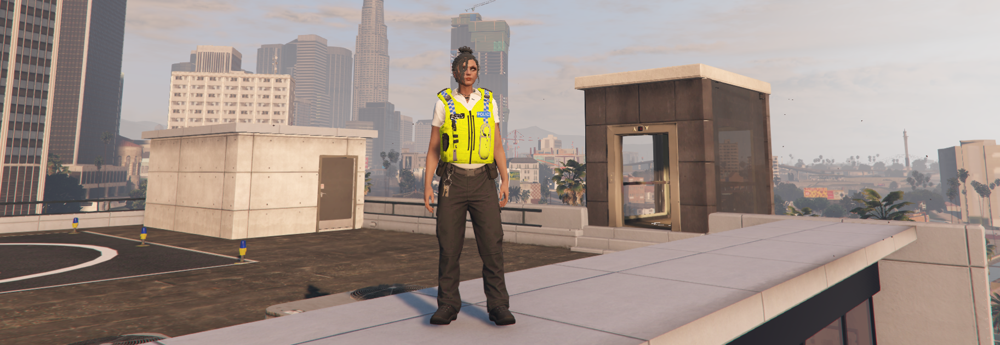

# 👔 PCSO / SO Uniforms

### <mark style="color:blue;">PCSO Male</mark>

.png>)

* Hats/Helmets - 209 (optional)&#x20;
* Shirts/Jackets - 428 (index 1)&#x20;
* Arms/Torso - 1&#x20;
* Undershirt - 206&#x20;
* Legs - 147&#x20;
* Shoes - 25&#x20;
* Vests - 67

### <mark style="color:blue;">PCSO Female</mark>

.png>)

* Shirts/Jackets - 401 ( Index 4)&#x20;
* Arms/Torso - 14&#x20;
* Undershirt - 248&#x20;
* Legs - 135 (index 1)&#x20;
* Shoes - 25&#x20;
* Vests - 64 (index 1)

### <mark style="color:blue;">SO Male</mark>

.png>)

* Hats/Helmets - 209 (optional)&#x20;
* Shirts/Jackets - 428 (index 0)&#x20;
* Arms/Torso - 1&#x20;
* Undershirt - 206&#x20;
* Legs - 147&#x20;
* Shoes - 25&#x20;
* Vests - 67

### <mark style="color:blue;">SO Female</mark>

* Shirts/Jackets - 401 ( Index 3)&#x20;
* Arms/Torso - 14&#x20;
* Undershirt - 248&#x20;
* Legs - 135 (index 1)&#x20;
* Shoes - 25&#x20;
* Vests - 64 (index 1)
